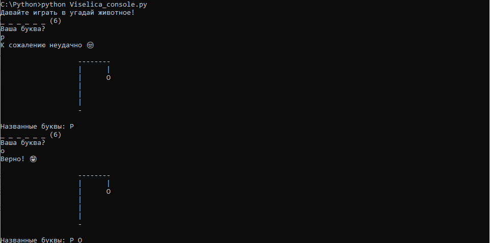
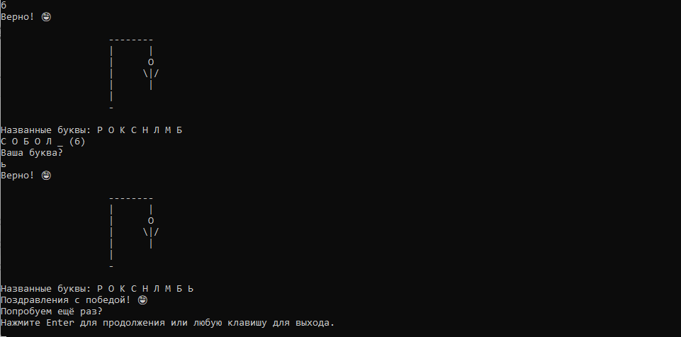

# Игра "Виселица" на Python

Три версии игры:
1. Консольная (`Viselica_console.py`)
2. Графическая с tkinter (`Viselica_gui.py`)
3. EXE - файл(`Viselica.exe`)
## Как запустить?
### Консольная версия
```bash
python hangman_console.py
```

### Графическая версия (требуется tkinter)
```bash
python hangman_gui.py
```

## Особенности
- Угадывание животных
- 6 попыток
- Поддержка русского языка

## 📥 Скачать игру
Готовую версию для Windows можно скачать [здесь](dist/Viselica.exe).

## 🔨 Сборка из исходников
```bash
pip install pyinstaller
pyinstaller --onefile --windowed src/hangman_gui.py
```

## 📦 Готовая сборка
- [Скачать hangman_gui.exe](dist/Viselica.exe) (Windows)
- Версия: 1.0 (дата сборки)

## 🛠 Для разработчиков
Исходный код в папке `src/`.

##  Скриншоты игры.


  


